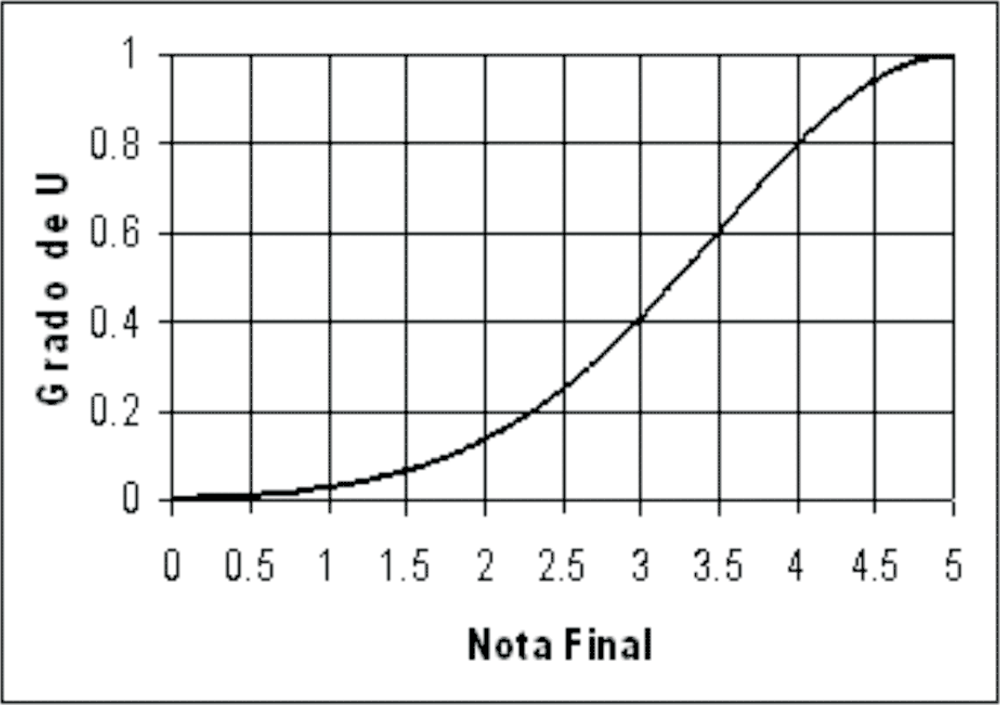
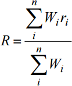
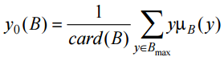
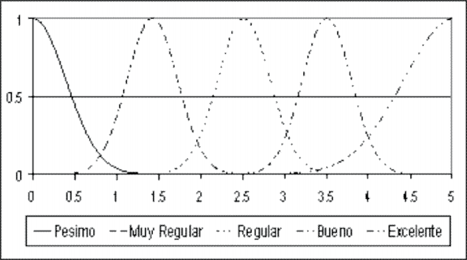
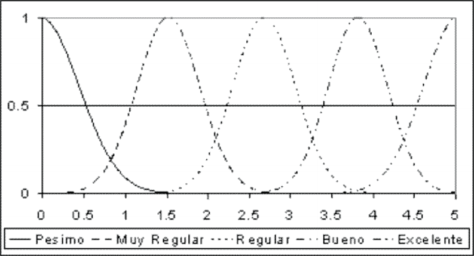
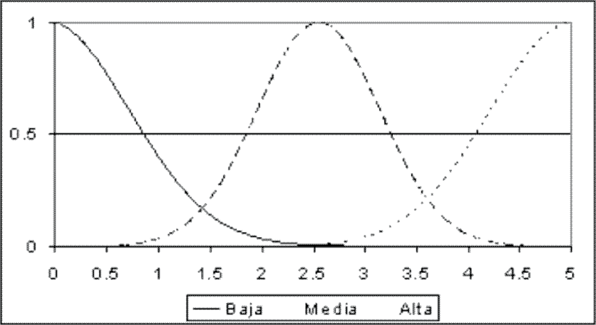
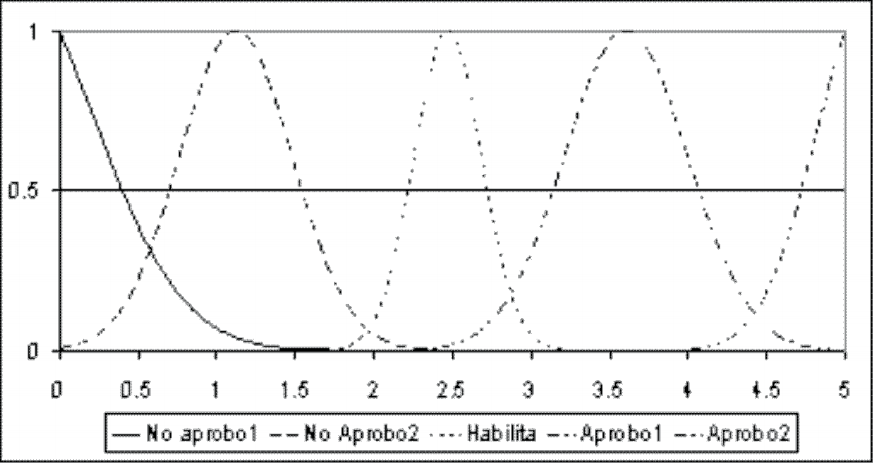
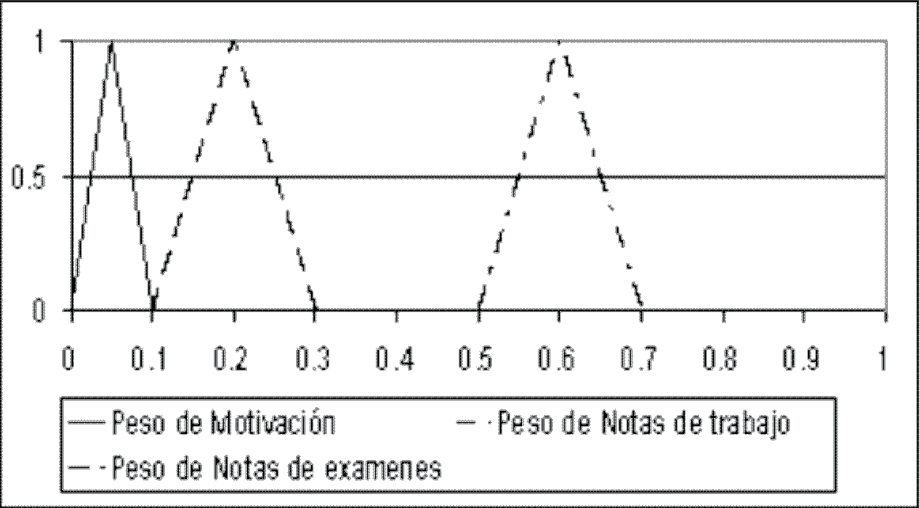
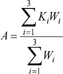
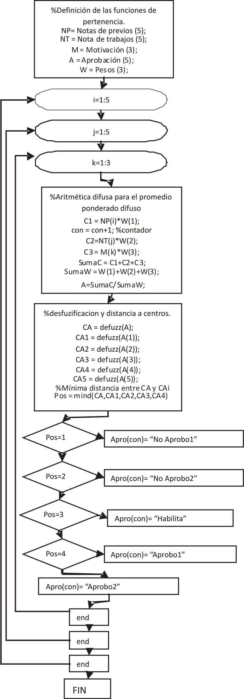

# Lógica difusa en la educación
## Germán Martínez Maldonado
## Inteligencia Computacional
### Máster Universitario en Ingeniería Informática
### 1. Introducción al problema
Generalmente la evaluación de un alumno en una asignatura solo se realiza mediante una única dimensión, una nota final que ha obtenido en base a los diferentes trabajos/exámenes evaluables, esta nota es la que indicará si el alumno es apto o no para superar la asignatura. El problema que puede presentar este tipo de sistemas de evaluación es el de decidir si siempre que un alumno no llega a entrar en el umbral de calificación que se considera aprobado se debe considerar que el alumno no ha superado la asignatura, o si de forma general se puede definir una zona de proximidad numérica de dicho umbral en el que también se podría considerar que el alumno supera la materia.

Es por eso que se puede plantear el uso de más variables para realizar dicha evaluación que no tienen por qué basarse exclusivamente en medidas cuantitativas como son las notas numéricas parar representar el rendimiento del alumno, también se puede tener en cuenta otros factores cualitativos como es el propio interés del alumno por la materia dada, lo que podría darnos una nueva dimensión que nos permita que los resultados sean más globales.

Para explicar esto, voy a exponer un método alternativo de calificación que usaron los autores de un artículo sobre esta temática: Iván Darío Gómez Araújo, Jabid Eduardo Quiroga Méndez y Neyid Mauricio Jasbón Carvajal de la Universidad Industrial de Santander, Bucaramanga (Colombia).

Estos autores proponen un método alternativo de calificación usando un sistema de inteligencia artificial que se basa en la lógica difusa usando como datos de entrada las calificaciones de trabajos, exámenes y el interés del estudiante respecto a la asignatura, una dimensión subjetiva que puede abarcar la disposición y participación del alumno ante la asignatura, elementos que se pueden evaluar mediante términos lingüísticos que tradicionalmente no toman parte en la calificación numérica de una asignatura.

#### 2. Marco teórico
Si entendemos que la lógica difusa como un mecanismo que nos permite interpretar una información en un entorno ambiguo comprenderemos rápidamente la aplicación para este caso concreto en el que deberíamos concretar exactamente que podríamos entender como un "estudiante deficiente" o un "estudiante excelente". Una vez aclaro esto, debemos pasar a definir los distintos elementos básicos necesarios como son los conjuntos difusos, las funciones de permanencia y las diferentes operaciones aritméticas y sistemas de inferencia difusos.

#### 2.1 Conjuntos difusos y funciones de pertenencia
Suponemos que X es una colección de objetos nombramos como x, X = {x1, x2, ..., xn}, un subconjunto difuso de A en X es un conjunto de pares ordenados A = {µA(x)|x,x∈X}; donde µA(x) es la función de permanencia de x en A, esta función define el conjunto difuso indicando el grado de pertenencia en el cual el elemento x está incluido en el subconjunto A.

Por ejemplo, si quisiéramos representar el grado de pertenencia de un estudiante al conjunto "estudiante excelente" basada en una nota final representada en un rango [0-5], podríamos establecer que el eje horizontal x se corresponda con el valor de la nota final del alumno y que el eje vertical y se corresponda con el grado de pertenencia de ese alumno al conjunto "estudiante excelente" en un rango [0-1].

La construcción de un conjunto difuso supone la construcción de una función de pertenencia que se podrá determinar en base a diferentes criterios o procedimientos y que implica el uso de diferentes técnicas estadísticas y de inteligencia artificial.

#### 2.2 Variables lingüísticas
Los modelos puramente numéricos son muy ineficientes para modelar el conocimiento humano y los proceso de toma de decisiones complejos, sin embargo las representaciones lingüísticas si se adaptar muy bien a la realidad, ya que nos dan una mayor facilidad para analizar y modelar sistemas.

Por ejemplo, teniendo un rango de notas de 0 a 10 podemos definir las restricciones difusas "malo", "normal" y "bueno" para clasificar a los alumnos de la siguiente forma:
- **malo:** { 1/1.0, 2/0.8, 3/0.4, 4/0.1, 5/0.0 }
- **normal:** { 2/0.1, 3/0.4, 4/0.8, 5/1.0, 6/0.8, 7/0.4, 8/0.1 }
- **bueno:** { 5/0.0, 6/0.1, 7/0.4, 8/0.8, 10/1.0 }

#### 2.3 Operaciones aritméticas difusas
La aritmética difusa se basa en el principio de extensión, que nos permite transformar conjuntos difusos de iguales o distintos universos por medio de una función, por considerando los conjuntos A y B:
- A = {µ(i) Ii}
- B = {µ(j) Ij}

Las operaciones básicas de suma, producto y división serían:
- **Suma (OR):** A+B = max{min(µA(i), µB(j) l[i+j])}
- **Producto (AND):** A·B = max{min(µA(i), µb(j) l[i·j])}
- **División (XOR):** A⊕B = max{min(µA(i), µb(j) l[i⊕j])}

Siendo los conjuntos difusos resultantes de estas funciones de pertenencia intervalos difusos si A y B son intervalos, y número difusos si A y B son números difusos.

#### 2.4 Codificación
##### 2.4.1 Peso promedio difuso
Los pesos promedio difusos serán los distintos valores de cada una de las notas a tener en cuenta para la determinación de la nota final, este peso promedio difuso se calculará partiendo de las dos entidades Wi y ri (ambas cantidades difusas) siendo necesarias las operaciones aritméticas antes descritas:

##### 2.4.2 Distancia entre conjuntos
Con el peso promedio calculado tendremos el conjunto difuso resultante, ahora necesitamos transformarlo al lenguaje natural para poder interpretarlo. Para poder hacer esto necesitaremos calcular la distancia entre el conjunto resultante y el conjunto base de las expresiones del lenguaje natural. Los autores han utilizado en este caso la distancia Hamming como método para calcular la distancia entre dos conjuntos difusos A y C.

Este método consiste en comparar dos elementos distintos para ver en cuantos elementos difieren, a mayor diferencia, menor posibilidad de que los elementos de un tipo se conviertan en los de otro.

#### 2.5 Decodificación
Como resultado del sistema difuso obtendremos variables lingüísticas que necesitaremos transformar en resultados escalares cuantificables, siendo el método de transformación escogido el centro de gravedad y0(B), que considera toda la función de pertenencia en el proceso de transformación para buscar la localización central que este igual de cerca de todos los elementos, lo que corresponderá a una estrategia de valor medio.

El valor de y0(B) se refiere a la media de los pesos de todo el supp(B) (los elementos del conjunto difuso con funciones de pertenencia mayor que) como:

Siendo card(B) la suma de las funciones de pertenencia µB(y), B la salida difusa y µB su función de pertenencia.

#### 2.6 Sistema de inferencia difusa
El proceso de inferencia difusa por el cual al evaluar unas entradas mediante reglas de lógica difusa obtendremos unas salidas concretas se compone de las funciones de pertenencia, operaciones lógicas y reglas IF, THEN.

Los autores, para este experimento han empleado el método de inferencia difuso de Mamdani que se compone de 5 etapas:
1. Transformación de las variables de entrada de escalares a lingüísticas.
2. Aplicación de los operadores difusos AND y OR en el antecedente (IF).
3. Determinar las consecuencias (THEN) de cada una de las reglas.
4. Agregar todas las salidas de las reglas para obtener la salida de todo el sistema.
5. Decodificar la salida para obtener un valor exacto usando el método del centro de gravedad.

#### 3. Metodología del experimento
En esta sección se va a exponer como se llevó a la práctica todo el sistema de lógica difusa planteado en las secciones anteriores. El sistema va a tener tres entradas: _notas de exámenes_ (**NP**), _notas de tareas y calificaciones adicionales_ (**NT**) y el componente subjetivo de _motivación del estudiante_ (**M**). El universo para NP y NT se estableció en un intervalo **0-5** con las _variables lingüísticas_ asociadas: **"Pésimo"**, **"Muy regular"**, **"Regular"**, **"Bueno"** y **"Excelente"**. Para la _entrada M_ se establecieron las variables **"Baja"**, **"Media"** y **"Alta"**. La función de pertenencia definida para cada una de las variables lingüísticas fue de tipo Gaussiana.
- Funciones de pertenencia para notas de exámenes:

- Funciones de pertenencia para notas de trabajos:

- Funciones de pertenencia para la motivación del estudiante:

Solo se estableció una salida para el _nombre de aprobación_ (**A**). La zona que comprende la **"No aprobación"** se dividió en dos variables: **"No Aprobo1"** y **"No Aprobo2"**, correspondientes a las _notas inferiores a 2_; la zona de **"Habilitación"** corresponde a _notas entre 2 y 3_; finalmente, la zona de **"Aprobación"** se dividió también en dos variables: **"Aprobo1"** y **"Aprobo2"**, correspondientes a las _notas mayores a 3_. Las zonas de "Aprobación" y "No aprobación" fueron divididas para facilitar el fijar la nota final.
- Variable de salida del sistema difuso:

Como estamos ante un sistema difuso con muchas variables lingüísticas de entradas y salidas (**18 en total**) por combinatoria de estas se producirán también un gran número de reglas (**75 reglas**); esto hará que sea más difícil establecer las relacionas de casualidad por la que unas determinadas entradas genera unas salidas concretas.

Debido a esto, los autores proponen un método automático de generación de reglas usando la aritmética difusa, relacionado las variables lingüísticas de cada entrada con las variables lingüísticas de salida. Para hacer esto se se asignó un peso a cada entrada en relación con la importancia de la entrada con respecto a la evaluación total del desempeño del estudiante.
- Pesos de los parámetros de entrada para la creación de reglas

Para combinar la información difusa con diferentes pesos se usó el promedio ponderado difuso A, que a su vez generará una nueva función de pertenencia. Siendo Ki la función de pertenencia asociada a cada variables lingüística del parámetro de entrada i (NP, NT, M) y W la función de pertenencia según la importancia de cada parámetro de entrada i.

El cálculo del promedio ponderado difuso para relacionar la entrada con la salida se realizó siguiendo los siguientes pasos:
1. Se seleccionaron todas las combinaciones posibles de las variables lingüísticas y sus entradas, obteniendo un total de 75 combinaciones como habíamos descrito antes.
2. Se combinaron las variables de entrada junto con las funciones de importancia mediante del promedio ponderado difuso, con esto se consigue obtener un conjunto difuso de salida con unos valores en el intervalo 0-5.
3. Se transforma el conjunto difuso resultante en una de las expresiones lingüísticas definidas: No aprobo1, No aprobo2, Habilita, Aprobo1 y Aprobo2. Para realizar esta transformación se realiza la siguiente secuencia:
  31. Se transforman mediante el método del centro de gravedad las variables lingüísticas en valores escalares del conjunto difuso resultante y las funciones de pertenencia de salida.
  32. Se determina la distancia entre el conjunto difuso resultante y las funciones de pertenencia de la salida.
  33. Se asigna la variable lingüística de salida a la regla creada usando la distancia mínima entre el conjunto difuso resultante y las funciones de permanencia de la salida.

En el sistema difuso propuesto se utilizó un motor de inferencia tipo Mamdani descrito en la sección anterior.

#### 4. Resultados

Para comprobar el resultado de sistema se van a proponer situaciones realistas en las que el grado de incertidumbre para decidir si el alumno aprueba o no es alto. (Nota: "Habilita" se refiere a que el alumno no aprueba directamente, pero tiene la opción de hacer  examen aprobatorio si se producen ciertas condiciones.)

| Escalera 	| NP 	| NT 	| M 	| Nota Final 	| Salida 	|
|:--------:	|:---:	|:---:	|:-----:	|:----------:	|:--------:	|
| 1 	| 2,8 	| 3,1 	| Baja 	| 2,89 	| Habilita 	|
| 1 	| 2,8 	| 3,1 	| Media 	| 2,96 	| Aprobo1 	|
| 1 	| 2,8 	| 3,1 	| Alta 	| 3,01 	| Aprobo1 	|
| 2 	| 3,1 	| 2,5 	| Baja 	| 2,91 	| Habilita 	|
| 2 	| 3,1 	| 2,5 	| Media 	| 2,99 	| Aprobo1 	|
| 2 	| 3,1 	| 2,5 	| Alta 	| 3,05 	| Aprobo1 	|
| 3 	| 3 	| 2 	| Baja 	| 2,65 	| Habilita 	|
| 3 	| 3 	| 2 	| Media 	| 2,74 	| Habilita 	|
| 3 	| 3 	| 2 	| Alta 	| 2,86 	| Habilita 	|
| 4 	| 3 	| 3,2 	| Baja 	| 3,02 	| Aprobo1 	|
| 4 	| 3 	| 3,2 	| Media 	| 3,1 	| Aprobo1 	|
| 4 	| 3 	| 3,2 	| Alta 	| 3,24 	| Aprobo1 	|

A la vista de los resultados podemos ver lo siguiente:

- En los escenarios 1 y 2, los estudiantes que estaban cerca del umbral de aprobar el curso y tenían una mayor motivación fueron los que finalmente terminaron aprobando.

- En el escenario 3, la motivación no llega a ser determinante para aprobar porque las notas son muy bajas.

- En el escenario 4, la situación es totalmente opuesta a la interior, las notas son tan altas que la motivación no termina por afectar a la nota final del alumno.

Las pruebas realizadas demuestran que el sistema es confiable para establecer decisiones sobre el alumno aprobará o no el curso cuando los valores de las notas están en el umbral cercano al aprobado, situación en la que la motivación puede entrar a ser considerada para predecir que ante una alta motivación, el alumno finalmente aprobará.

#### 5. Conclusiones

El sistema difuso implementado lo que pretendía era imitar el pensamiento del docente cuando tiene que decidir si un alumno que este en el umbral merece aprobar o no. Generalmente dicho docente utilizaría otras variables subjetivas independientes de las notas puestas durante el curso, por eso para desarrollar el sistema se ha tenido en cuenta un aspecto puramente subjetivo como puede ser la motivación del alumno.

Puestos en una situación como la descrita, el sistema demostró su confiabilidad al ser capaz de mediante su sistema de inferencia difuso decidir objetivamente si el alumno aprobaría o no el curso en función de un proceso sistemático de análisis de información.

En vista de los resultados, cabe considerar que cada vez debería ser más importante en la calificación elementos más subjetivos como la participación activa en clase y la predisposición a trabajar las materias.

#### Bibliografía

- Diapositivas de teoría

- [http://www.educacioneningenieria.org/index.php/edi/article/download/83/73](http://www.educacioneningenieria.org/index.php/edi/article/download/83/73)

- [http://es.slideshare.net/mentelibre/relaciones-difusas-graficas-difusas-y-aritmtica-difusa](http://es.slideshare.net/mentelibre/relaciones-difusas-graficas-difusas-y-aritmtica-difusa)
- [http://palmia.galeon.com/capitulo54.htm](http://palmia.galeon.com/capitulo54.htm)
- [http://profesores.elo.utfsm.cl/~tarredondo/info/soft-comp/Introduccion%20a%20la%20Logica%20Difusa.pdf](http://profesores.elo.utfsm.cl/~tarredondo/info/soft-comp/Introduccion%20a%20la%20Logica%20Difusa.pdf)
- [http://webpersonal.uma.es/~MORILLAS/DATOSDIFUSOS.pdf](http://webpersonal.uma.es/~MORILLAS/DATOSDIFUSOS.pdf)
- [http://www.csee.wvu.edu/classes/cpe521/presentations/DEFUZZ.pdf](http://www.csee.wvu.edu/classes/cpe521/presentations/DEFUZZ.pdf)
- [http://www.lcc.uma.es/~ppgg/FSS/FSS5.pdf](http://www.lcc.uma.es/~ppgg/FSS/FSS5.pdf)
- [https://es.wikipedia.org/wiki/Distancia_de_Hamming](https://es.wikipedia.org/wiki/Distancia_de_Hamming)
- [http://www.monografias.com/trabajos55/metodos-localizacion-instalaciones/metodos-localizacion-instalaciones2.shtml](http://www.monografias.com/trabajos55/metodos-localizacion-instalaciones/metodos-localizacion-instalaciones2.shtml)
