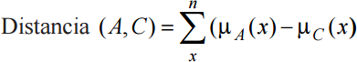

# Lógica difusa en la educación

## Germán Martínez Maldonado
## Inteligencia Computacional
### Máster Universitario en Ingeniería Informática

### 1. Introducción al problema

Generalmente la evaluación de un alumno en una asignatura solo se realiza mediante una única dimensión, una nota final que ha obtenido en base a los diferentes trabajos/exámenes evaluables, esta nota es la que indicará si el alumno es apto o no para superar la asignatura. El problema que puede presentar este tipo de sistemas de evaluación es el de decidir si siempre que un alumno no llega a entrar en el umbral de calificación que se considera aprobado se debe considerar que el alumno no ha superado la asignatura, o si de forma general se puede definir una zona de proximidad numérica de dicho umbral en el que también se podría considerar que el alumno supera la materia.

Es por eso que se puede plantear el uso de más variables para realizar dicha evaluación que no tienen por qué basarse exclusivamente en medidas cuantitativas como son las notas numéricas parar representar el rendimiento del alumno, también se puede tener en cuenta otros factores cualitativos como es el propio interés del alumno por la materia dada, lo que podría darnos una nueva dimensión que nos permita que los resultados sean más globales.

Para explicar esto, voy a exponer un método alternativo de calificación que usaron los autores de un artículo sobre esta temática: Iván Darío Gómez Araújo, Jabid Eduardo Quiroga Méndez y Neyid Mauricio Jasbón Carvajal de la Universidad Industrial de Santander, Bucaramanga (Colombia).

Estos autores proponen un método alternativo de calificación usando un sistema de inteligencia artificial que se basa en la lógica difusa usando como datos de entrada las calificaciones de trabajos, exámenes y el interés del estudiante respecto a la asignatura, una dimensión subjetiva que puede abarcar la disposición y participación del alumno ante la asignatura, elementos que se pueden evaluar mediante términos lingüísticos que tradicionalmente no toman parte en la calificación numérica de una asignatura.

#### 2. Marco teórico

Si entendemos que la lógica difusa como un mecanismo que nos permite interpretar una información en un entorno ambiguo comprenderemos rápidamente la aplicación para este caso concreto en el que deberíamos concretar exactamente que podríamos entender como un "estudiante deficiente" o un "estudiante excelente". Una vez aclaro esto, debemos pasar a definir los distintos elementos básicos necesarios como son los conjuntos difusos, las funciones de permanencia y las diferentes operaciones aritméticas y sistemas de inferencia difusos.

#### 2.1 Conjuntos difusos y funciones de pertenencia

Suponemos que X es una colección de objetos nombramos como x, X = {x1, x2, ..., xn}, un subconjunto difuso de A en X es un conjunto de pares ordenados A = {µA(x)|x,x∈X}; donde µA(x) es la función de permanencia de x en A, esta función define el conjunto difuso indicando el grado de pertenencia en el cual el elemento x está incluido en el subconjunto A.

Por ejemplo, si quisiéramos representar el grado de pertenencia de un estudiante al conjunto "estudiante excelente" basada en una nota final representada en un rango [0-5], podríamos establecer que el eje horizontal x se corresponda con el valor de la nota final del alumno y que el eje vertical y se corresponda con el grado de pertenencia de ese alumno al conjunto "estudiante excelente" en un rango [0-1].

La construcción de un conjunto difuso supone la construcción de una función de pertenencia que se podrá determinar en base a diferentes criterios o procedimientos y que implica el uso de diferentes técnicas estadísticas y de inteligencia artificial.

#### 2.2 Variables lingüísticas

Los modelos puramente numéricos son muy ineficientes para modelar el conocimiento humano y los proceso de toma de decisiones complejos, sin embargo las representaciones lingüísticas si se adaptar muy bien a la realidad, ya que nos dan una mayor facilidad para analizar y modelar sistemas.

Por ejemplo, teniendo un rango de notas de 0 a 10 podemos definir las restricciones difusas "malo", "normal" y "bueno" para clasificar a los alumnos de la siguiente forma:

- **malo:** { 1/1.0, 2/0.8, 3/0.4, 4/0.1, 5/0.0 }
- **normal:** { 2/0.1, 3/0.4, 4/0.8, 5/1.0, 6/0.8, 7/0.4, 8/0.1 }
- **bueno:** { 5/0.0, 6/0.1, 7/0.4, 8/0.8, 10/1.0 }

#### 2.3 Operaciones aritméticas difusas

La aritmética difusa se basa en el principio de extensión, que nos permite transformar conjuntos difusos de iguales o distintos universos por medio de una función, por considerando los conjuntos A y B:

- A = {µ(i) Ii}
- B = {µ(j) Ij}

Las operaciones básicas de suma, producto y división serían:

- **Suma (OR):** A+B = max{min(µA(i), µB(j) l[i+j])}

- **Producto (AND):** A·B = max{min(µA(i), µb(j) l[i·j])}

- **División (XOR):** A⊕B = max{min(µA(i), µb(j) l[i⊕j])}

Siendo los conjuntos difusos resultantes de estas funciones de pertenencia intervalos difusos si A y B son intervalos, y número difusos si A y B son números difusos.

#### 2.4 Codificación

##### 2.4.1 Peso promedio difuso

Los pesos promedio difusos serán los distintos valores de cada una de las notas a tener en cuenta para la determinación de la nota final, este peso promedio difuso se calculará partiendo de las dos entidades Wi y ri (ambas cantidades difusas) siendo necesarias las operaciones aritméticas antes descritas:

##### 2.4.2 Distancia entre conjuntos

Con el peso promedio calculado tendremos el conjunto difuso resultante, ahora necesitamos transformarlo al lenguaje natural para poder interpretarlo. Para poder hacer esto necesitaremos calcular la distancia entre el conjunto resultante y el conjunto base de las expresiones del lenguaje natural. Los autores han utilizado en este caso la distancia Hamming como método para calcular la distancia entre dos conjuntos difusos A y C.

Este método consiste en comparar dos elementos distintos para ver en cuantos elementos difieren, a mayor diferencia, menor posibilidad de que los elementos de un tipo se conviertan en los de otro.

#### 2.5 Decodificación

Como resultado del sistema difuso obtendremos variables lingüísticas que necesitaremos transformar en resultados escalares cuantificables, siendo el método de transformación escogido el centro de gravedad y0(B), que considera toda la función de pertenencia en el proceso de transformación, lo que corresponderá a una estrategia de valor medio.

El valor de y0(B) se refiere a la media de los pesos de todo el supp(B) (los elementos del conjunto difuso con funciones de pertenencia mayor que) como:

Siendo card(B) la suma de las funciones de pertenencia µB(y), B la salida difusa y µB su función de pertenencia.

#### 2.6 Sistema de inferencia difusa

El proceso de inferencia difusa por el cual al evaluar unas entradas mediante reglas de lógica difusa obtendremos unas salidas concretas se compone de las funciones de pertenencia, operaciones lógicas y reglas IF, THEN.

Los autores, para este experimento han empleado el método de inferencia difuso de Mamdani que se compone de 5 etapas:

1. Transformación de las variables de entrada de escalares a lingüísticas.
2. Aplicación de los operadores difusos AND y OR en el antecedente (IF).
3. Determinar las consecuencias (THEN) de cada una de las reglas.
4. Agregar todas las salidas de las reglas para obtener la salida de todo el sistema.
5. Decodificar la salida para obtener un valor exacto usando el método del centro de gravedad.
